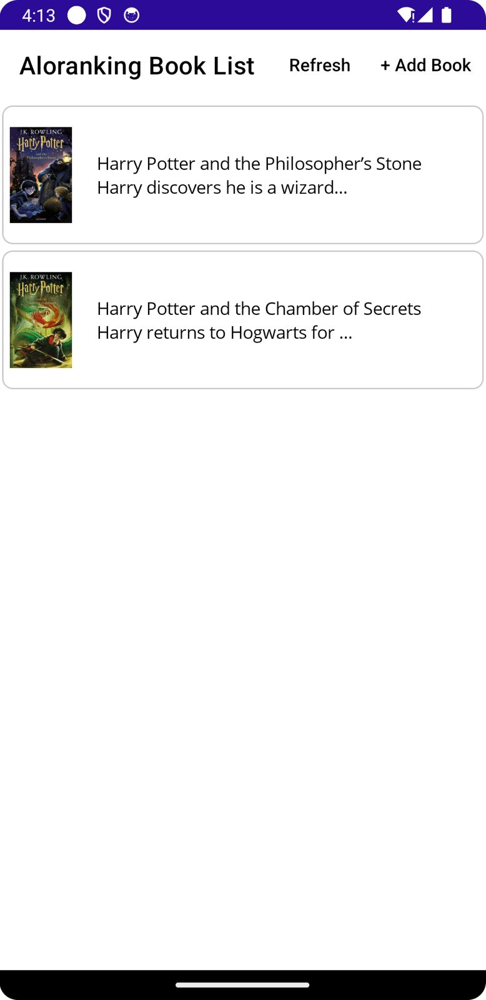
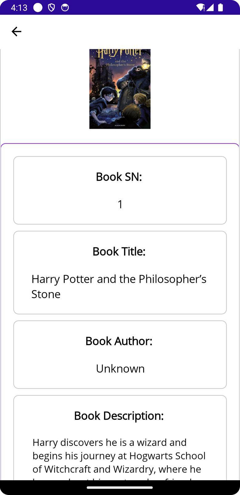
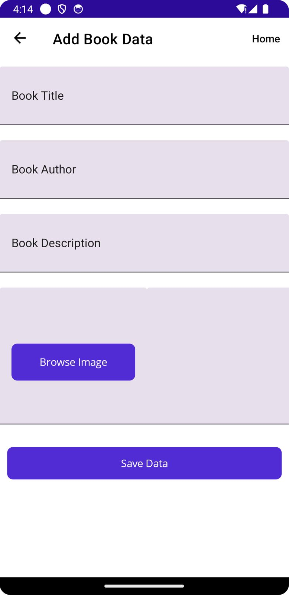

# 📚 BookDatabase App

A cross-platform .NET MAUI app to manage and store book details locally using **SQLite**.

---

## ✨ Features

- 📖 Add new books (title, author, description, etc.)
- 📋 View a list of all saved books
- ✏️ Edit or 🗑️ delete existing books
- 💾 Local data persistence with SQLite
- 📱 Works on Android, iOS, Windows, and macOS

---

## 🛠️ Tech Stack

- **.NET MAUI** — Multi-platform UI framework
- **SQLite** — Local database via [`sqlite-net-pcl`](https://www.nuget.org/packages/sqlite-net-pcl)
- **MVVM** — With `CommunityToolkit.Mvvm` or `MvvmHelpers`
- **CommunityToolkit.Maui** — Toast notifications, helpers, etc.

---

## 🚀 Getting Started

### ✅ Prerequisites

- [.NET 8 SDK](https://dotnet.microsoft.com/download)
- Visual Studio 2022/2023 with MAUI workload enabled

### 📦 Required NuGet Packages

Install the following packages:

```bash
dotnet add package sqlite-net-pcl
dotnet add package CommunityToolkit.Maui
dotnet add package CommunityToolkit.Mvvm
dotnet add package Syncfusion.Maui.Core
```


The SQLite database is stored in the device’s local app data directory:
```bash
Path.Combine(Environment.GetFolderPath(Environment.SpecialFolder.LocalApplicationData), "DemoBookDB.db3");
```


🧪 Running the App

🔧 From Terminal
	1.	Clone the repo:
```bash
git clone https://github.com/your-username/BookDatabase.git
cd BookDatabase
```

  2.	Restore packages:
```bash
dotnet restore
```

  3.	Build and run:
```bash
dotnet build
dotnet run
  ```

## 📸 Screenshots

### Book List Page

  


### Book Detail Page

 

### Add Book Page

 

🙌 Credits
	•	Built with 💙 using .NET MAUI
	•	SQLite powered by sqlite-net-pcl
	•	Toasts and MVVM support via CommunityToolkit.Maui
